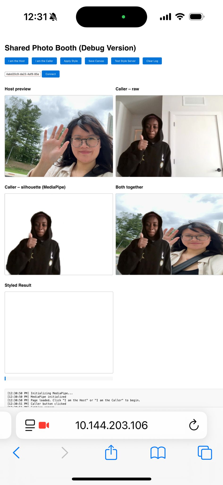

# Virtual Photobooth


A browser-based collaborative photo booth that combines peer-to-peer video streaming with AI-powered artistic style transfer. Two remote users connect via WebRTC to create shared portraits - one person acts as the background (host) while the other appears as a foreground silhouette (caller). The combined image is then processed through a pix2pix neural network to apply artistic style transfer in real-time.

## Demo

### System in Action



*Real-time video compositing and style transfer showing the complete workflow*

## Features

- **Peer-to-peer video connection** - Host and caller connect directly through PeerJS without requiring a central video server
- **Real-time background removal** - MediaPipe Selfie Segmentation extracts the caller's silhouette with no green screen needed
- **AI-powered style transfer** - Custom-trained pix2pix model applies artistic filters to the combined portrait
- **Live canvas compositing** - Real-time video blending using HTML5 Canvas API
- **Debug interface** - Built-in logging and testing tools for troubleshooting connections and API calls

## How It Works

**Technical Pipeline:**

1. **Video Capture**: Both users grant camera access via WebRTC
2. **Peer Connection**: PeerJS establishes direct video streaming between host and caller
3. **Background Removal**: MediaPipe Selfie Segmentation isolates the caller's silhouette in real-time
4. **Compositing**: Canvas API combines host video (background) with caller silhouette (foreground)
5. **Style Transfer**: Combined image sent to Flask server running pix2pix model
6. **Rendering**: Styled result displayed in final canvas

## Prerequisites

### Client-Side
- Modern web browser (tested on Safari, also works on Chrome/Edge)
- Webcam access
- HTTPS connection (required for `getUserMedia` API)

### Server-Side
- **Python**: 3.9 or higher
- **GPU**: CUDA-capable GPU recommended for real-time inference (CPU works but slower)
- **PyTorch**: GPU-enabled build for acceleration

## Installation

### 1. Clone the Repository

```bash
git clone https://github.com/Timamamu/virtual-photobooth.git
cd virtual-photobooth
```

### 2. Download the Pre-trained Model

Download the pix2pix model from Google Drive:

**Model Files**: [Download S4_MODEL](https://drive.google.com/drive/folders/1KiOjvH8CspsFljpniYZweCA-7mzMdIw9?usp=share_link)

Extract the model folder and place it in your project directory:

```
virtual-photobooth/
├── models/
│   └── S4_MODEL/
│       └── (model checkpoint files)
├── server.py
├── index.html
└── ...
```

### 3. Install Python Dependencies

Create and activate a virtual environment:

```bash
python -m venv .venv
source .venv/bin/activate  # On Windows: .venv\Scripts\activate
```

Install required packages:

```bash
pip install flask flask-cors pillow torch torchvision opencv-python numpy
```

**Note**: For GPU acceleration, install PyTorch with CUDA support following the [official PyTorch installation guide](https://pytorch.org/get-started/locally/).

### 4. Generate SSL Certificates

The Flask server requires HTTPS for secure communication with the browser. Generate self-signed certificates:

```bash
openssl req -x509 -newkey rsa:4096 -nodes -out cert.pem -keyout key.pem -days 365
```

When prompted, you can press Enter to use default values or fill in your information. The certificates will be created in your project root.

## Usage

### Step 1: Start the Style Server

Start the Flask backend:

```bash
python server.py
```

The server will start at `https://127.0.0.1:5000`.

**Accept the certificate warning:**
1. Open `https://127.0.0.1:5000/test` in your browser
2. Accept the security warning (self-signed certificate)
3. You should see a JSON response confirming the server is running

### Step 2: Serve the Frontend

In a new terminal, start a simple HTTP server:

```bash
python -m http.server 8000
```

Open `http://localhost:8000/index.html` in your browser.

**For HTTPS (recommended):**

If you need HTTPS for the frontend as well:

```bash
# Install http-server globally if you don't have it
npm install -g http-server

# Serve with SSL
http-server -S -C cert.pem -K key.pem -p 8000
```

Then visit `https://localhost:8000/index.html`

### Step 3: Connect Two Participants

**On the first device/browser window:**
1. Click **"I am the Host"**
2. Allow camera access when prompted
3. Copy the displayed Peer ID

**On the second device/browser window:**
1. Click **"I am the Caller"**
2. Allow camera access
3. Paste the Host's Peer ID into the input field
4. Click **"Connect"**

### Step 4: Apply Style Transfer

Once both video feeds appear and the combined canvas shows the composite image:

1. Click **"Apply Style"** to send the frame to the Flask server
2. Wait for processing (a few seconds)
3. The styled result appears in the "Styled Result" canvas

**Debug options:**
- **Save Canvas**: Opens the combined image in a new tab for inspection
- **Test Style Server**: Sends a synthetic test pattern to verify the API is working
- **Clear Log**: Clears the debug console at the bottom of the page

## Project Structure

```
virtual-photobooth/
├── assets/                      # Demo images
├── models/
│   └── S4_MODEL/               # Pre-trained pix2pix model
├── index.html                   # Main UI with inline JavaScript
├── server.py                    # Flask style transfer API
├── pix2pix_model.py            # Pix2pix generator wrapper
├── common_model.py             # Shared model utilities
├── common_loss.py              # Loss function helpers
├── cert.pem                     # SSL certificate (generated)
├── key.pem                      # SSL private key (generated)
└── README.md
```

## API Reference

### Flask Server Endpoints

**GET /**
- Health check endpoint
- Returns: Plain text status message

**GET /test**
- Server diagnostics
- Returns: JSON with server status, device (CPU/CUDA), and model path

**POST /style**
- Apply style transfer to an image
- Request body:
  ```json
  {
    "image": "data:image/png;base64,..."
  }
  ```
- Response:
  ```json
  {
    "image": "data:image/png;base64,..."
  }
  ```

## Troubleshooting

### Certificate Errors

**Problem**: Browser refuses to connect to `https://127.0.0.1:5000`

**Solution**: Manually visit `https://127.0.0.1:5000/test` and accept the certificate warning before using the "Apply Style" button.

### Model Not Found

**Problem**: `FileNotFoundError: Model folder not found: models/S4_MODEL`

**Solution**: 
- Verify the model folder exists at `models/S4_MODEL/`
- Check that you downloaded and extracted the complete model from Google Drive
- Ensure the folder structure matches what `Pix2PixModel.createFromFolder` expects

### Slow Inference

**Problem**: Style transfer takes 10+ seconds

**Solutions**:
- Use a machine with a CUDA-capable GPU
- Install PyTorch with CUDA support: `pip install torch torchvision --index-url https://download.pytorch.org/whl/cu118`
- Reduce input resolution in `server.py` (currently 128x128)

### PeerJS Connection Issues

**Problem**: Peers cannot connect or connection drops

**Solutions**:
- Check firewall settings - WebRTC needs UDP ports open
- The default PeerJS cloud broker (`0.peerjs.com`) may have rate limits
- For production use, consider hosting your own PeerJS server
- Both users must be on the same network or have proper NAT traversal

### Camera Access Denied

**Problem**: Browser doesn't show camera feed

**Solutions**:
- Grant camera permissions when prompted
- Ensure you're accessing via `https://` or `http://localhost`
- Check browser settings to verify camera isn't blocked
- Try a different browser (tested on Safari, Chrome, Edge)

### Canvas is Empty

**Problem**: "Apply Style" button shows "Canvas is empty"

**Solutions**:
- Ensure both video feeds are connected and visible
- Wait until the "Both together" canvas shows the composite image
- Check the debug log for segmentation errors
- Verify MediaPipe is loading correctly (check browser console)

## Technical Details

### MediaPipe Configuration

The selfie segmentation uses MediaPipe's model selection 1 (general model, 256×256 input). This provides a good balance between speed and quality for real-time processing.

### Canvas Compositing

The compositing uses HTML5 Canvas `globalCompositeOperation`:
- `destination-in`: Masks the caller video to just their silhouette
- `destination-out`: Removes the caller's silhouette area from the host video
- `source-over`: Combines the masked caller over the background

### Style Transfer Processing

Images are:
1. Resized to 128×128 for pix2pix input
2. Normalized to [0, 1] range
3. Processed through the generator
4. Post-processed and returned as base64-encoded PNG


## License

This project is open source and available under the [MIT License](LICENSE).

## Credits

**Development**: Fatima Mamu

### Technical Dependencies
- [PeerJS](https://peerjs.com/) - WebRTC peer-to-peer connections
- [MediaPipe](https://google.github.io/mediapipe/) - Selfie segmentation
- [PyTorch](https://pytorch.org/) - Neural network inference
- [Flask](https://flask.palletsprojects.com/) - API server

---

*A fun experimental project exploring real-time collaborative art through peer-to-peer video and neural style transfer*
